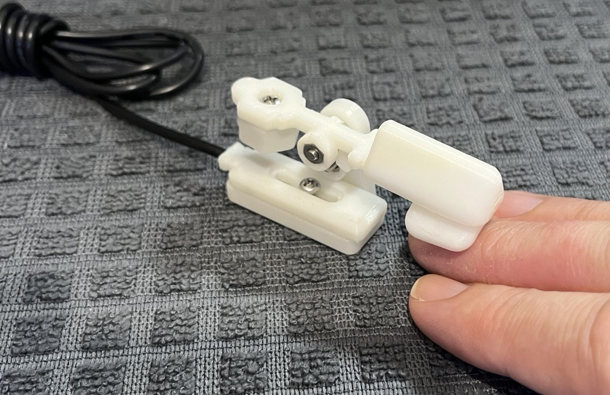

# Finger Lift Switch 
The Finger Lift Switch is an assistive switch that is activated by lifting a resting finger upwards. The switch activation distance is approximately 5 mm and the required force is about 5 grams-force.

Connect the cable to an assistive device with a 3.5 mm input jack. The user's lifting fingertip should be placed under the finger lift pad, resting on a lower surface or splint.
When the user raises their lifting finger, the finger lift lever will rotate and activate the switch. The switch will de-activate when the user lowers their lifting finger back to the resting surface. 

## More info at
- [Makers Making Change Project Page](https://makersmakingchange.com/project/finger-lift-switch/)

## How to Obtain a Finger Lift Switch
### 1. Do it Yourself (DIY) or Do it Together (DIT)

This is an open-source assistive technology, so anyone is free to build it. All of the files and instructions required to build the Finger Lift Switch are contained within this repository. Refer to the Maker Checklist below.

### 2. Request a build of this device

If you would like to obtain a Finger Lift Switch , you may submit a build request through the [MMC Library Page](https://makersmakingchange.com/project/finger-lift-switch/). The requestor is responsible for the cost of materials and any shipping.

### 3. How to build this device for someone else

If you have the skills and equipment to build this device, and would like to donate your time to create the switch for someone who needs it, visit the [MMC Maker Wanted](https://makersmakingchange.com/maker-wanted/) section.

## Getting Started

### 1. Read the Makers Checklist
Refer to the [Maker's Checklist](/Documentation/Finger_Lift_Switch_Maker_Checklist_v1.0.pdf) for an outline of the steps required to build the device.

### 2. Order the Off-The-Shelf Components

The [Bill of Materials](/Documentation/Finger_Lift_Switch_BOM_v1.0.xlsx) lists all of the parts and components required to build the device. The electronic and hardware component needs to be ordered online.

### 3. Print the 3D Printable components

All of the files and individual print files can be in the [/Build_Files/3D_Printing_Files](/Build_Files/3D_Printing/) folder.

### 4. Assemble the Finger Lift Switch

Reference the [Assembly Guide](/Documentation/Finger_Lift_Switch_Assembly_Guide_v1.0.pdf) for the tools and steps required to build each portion.

## Files
### Documentation
| Document             | Version | Link |
|----------------------|---------|------|
| Design Rationale     | 1.0     | [Finger_Lift_Switch_Design_Rationale](/Documentation/Finger_Lift_Switch_Design_Rationale_v1.0.pdf)     |
| Maker Checklist      | 1.0     | [Finger_Lift_Switch_Maker_Checklist](/Documentation/Finger_Lift_Switch_Maker_Checklist_v1.0.pdf)     |
| Bill of Materials    | 1.0     | [Finger_Lift_Switch_Bill_of_Materials](/Documentation/Finger_Lift_Switch_BOM_v1.0.xlsx)     |
| 3D Printing Guide    | 1.0     | [Finger_Lift_Switch_3D_Printing_Guide](/Documentation/Finger_Lift_Switch_3D_Printing_Guide_v1.0.pdf)     |
| Assembly Guide       | 1.0     | [Finger_Lift_Switch_Assembly_Guide](/Documentation/Finger_Lift_Switch_Assembly_Guide_v1.0.pdf)     |
| User Guide           | 1.0     | [Finger_Lift_Switch_User_Guide](/Documentation/Finger_Lift_Switch_User_Guide_v1.0.pdf)    |
| Changelog            | 1.0     | [Finger_Lift_Switch_Changelog](/Documentation/Finger_Lift_Switch_Changelog_v1.0.pdf)     |

### Design Files
[CAD Files](/Design_Files)

### Build Files
 - [3D Printing Files](/Build_Files/3D_Printing)

## Attribution
Designed by Makers Making Change (Derrick Andrews) in conjunction with Sunnyhill.

## License
Everything needed or used to design, make, test, or prepare the Low Profile Switch is licensed under the CERN 2.0 Permissive license <https://ohwr.org/project/cernohl/wikis/Documents/CERN-OHL-version-2> (CERN-OHL-P) . 

Accompanying material such as instruction manuals, videos, and other copyrightable works that are useful but not necessary to design, make, test, or prepare the Low Profile Switch are published under a Creative Commons Attribution-ShareAlike 4.0 license https://creativecommons.org/licenses/by-sa/4.0/ (CC BY-SA 4.0).

---
<!-- ABOUT MMC START -->
## About Makers Making Change

Makers Making Change is a program of [Neil Squire](https://www.neilsquire.ca/), a Canadian non-profit that uses technology, knowledge, and passion to empower people with disabilities.

Makers Making Change leverages the capacity of community based Makers, Disability Professionals and Volunteers to develop and deliver affordable Open Source Assistive Technologies.

 - Website: [www.MakersMakingChange.com](https://www.makersmakingchange.com/)
 - GitHub: [makersmakingchange](https://github.com/makersmakingchange)
 - Bluesky: [@makersmakingchange.bsky.social](https://bsky.app/profile/makersmakingchange.bsky.social)
 - Instagram: [@makersmakingchange](https://www.instagram.com/makersmakingchange)
 - Facebook: [makersmakechange](https://www.facebook.com/makersmakechange)
 - LinkedIn: [Neil Squire Society](https://www.linkedin.com/company/neil-squire-society/)
 - Thingiverse: [makersmakingchange](https://www.thingiverse.com/makersmakingchange/about)
 - Printables: [MakersMakingChange](https://www.printables.com/@MakersMakingChange)

### Contact Us
For technical questions, to get involved, or to share your experience we encourage you to [visit our website](https://www.makersmakingchange.com/) or [contact us](https://www.makersmakingchange.com/s/contact).
<!-- ABOUT MMC END -->
